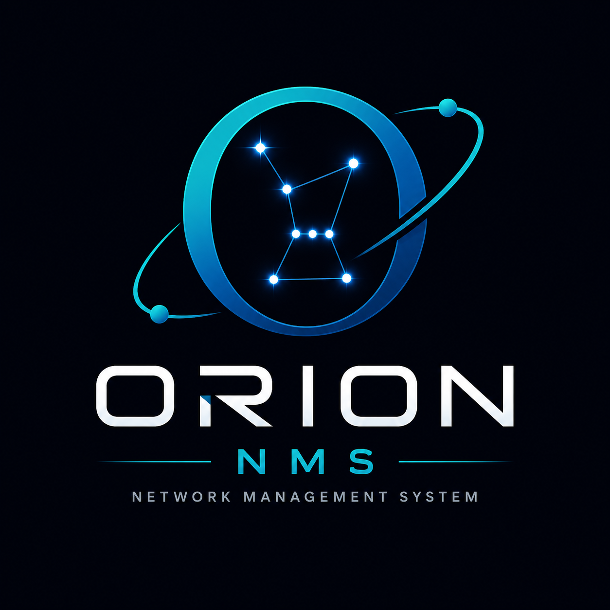

<p align="center">
  
</p>

<h1 align="center">ORION NMS</h1>

<p align="center">
  <strong>Plateforme de supervision réseau</strong> — monitoring, alertes, incidents, topologie, assistant IA et rapports.<br>
  Projet <strong>académique</strong> en développement local (pas de déploiement cloud prévu dans ce guide).
</p>

<p align="center">
  <a href="https://github.com/JoKonde/orion-nms">github.com/JoKonde/orion-nms</a>
</p>

---

## Sommaire

- [Vue d'ensemble](#vue-densemble)
- [Prérequis](#prérequis)
- [Structure du dépôt](#structure-du-dépôt)
- [Installation rapide](#installation-rapide)
- [1. ORION Core (API Laravel)](#1-orion-core-api-laravel)
- [2. Dashboard React](#2-dashboard-react)
- [3. Agent ORION (Electron)](#3-agent-orion-electron)
- [Réseau local : IP du serveur](#réseau-local--ip-du-serveur)
- [Nmap & découverte réseau](#nmap--découverte-réseau)
- [Temps réel (Reverb) & tâches planifiées](#temps-réel-reverb--tâches-planifiées)
- [ORION AI (optionnel)](#orion-ai-optionnel)
- [Utilisation du dashboard](#utilisation-du-dashboard)
- [Dépannage](#dépannage)

---

## Vue d'ensemble

ORION NMS est un **monorepo** composé de trois applications :

| Dossier | Rôle | Stack |
|---------|------|--------|
| `core/` | API centrale, base de données, alertes, métriques, IA | Laravel 10, MySQL |
| `dashboard/` | Interface d'administration | React 18, Vite |
| `agent/` | Collecte CPU, RAM, disque sur les postes supervisés | Electron + React |

```text
┌─────────────┐     métriques      ┌──────────────┐     REST API     ┌─────────────┐
│ Agent .exe  │ ────────────────► │  ORION Core  │ ◄────────────── │  Dashboard  │
│  (postes)   │     heartbeat     │  :8001       │     Sanctum     │  :5173      │
└─────────────┘                   └──────────────┘                 └─────────────┘
                                         │
                                         ▼
                                   MySQL (orion_core)
```

**Dépôt public :** [https://github.com/JoKonde/orion-nms](https://github.com/JoKonde/orion-nms.git)

---

## Prérequis

### Obligatoire

| Outil | Version | Notes |
|-------|---------|--------|
| **PHP** | **8.2** ou **8.3** | Laravel 10 et Laravel Reverb fonctionnent avec les deux. PHP 8.2+ est requis. |
| **Composer** | 2.x | Gestion des dépendances PHP |
| **Node.js** | 20+ | Dashboard et Agent |
| **npm** | 9+ | Inclus avec Node.js |
| **MySQL** | 8.x | Base `orion_core` (MariaDB compatible) |

### Recommandé

| Outil | Usage |
|-------|--------|
| **Nmap** | Découverte des équipements sur le LAN ([nmap.org](https://nmap.org/download.html)) |
| **Git** | Cloner le dépôt |

### Environnement testé

- Windows 10/11 + Laragon ou XAMPP
- Réseau local (LAN) — le serveur et les agents communiquent via l’**IP LAN** du PC serveur

> Ce guide couvre uniquement l’**environnement de développement local**. Aucune étape de déploiement cloud n’est décrite ici.

---

## Structure du dépôt

```text
orion-nms/
├── core/           # API Laravel (backend)
├── dashboard/      # Interface React
├── agent/          # Agent desktop Electron
├── command.txt     # Rappel des commandes utiles
├── discussions.txt # Journal de développement
└── logo.png
```

---

## Installation rapide

```bash
git clone https://github.com/JoKonde/orion-nms.git
cd orion-nms
```

Puis configurez **Core → Dashboard → Agent** dans cet ordre (détails ci-dessous).

---

## 1. ORION Core (API Laravel)

### Installation

```powershell
cd core
composer install
copy .env.example .env
php artisan key:generate
```

### Base de données

1. Créez une base MySQL nommée `orion_core`.
2. Éditez `core/.env` :

```env
DB_DATABASE=orion_core
DB_USERNAME=root
DB_PASSWORD=votre_mot_de_passe
```

3. Migrez et initialisez les données :

```powershell
php artisan migrate
php artisan db:seed
php artisan config:clear
```

**Compte admin par défaut** (après `db:seed`) :

| Champ | Valeur |
|-------|--------|
| Email | `admin@orion.local` |
| Mot de passe | `Password123!` |

### Démarrer l'API (important : écoute réseau)

Pour que le **dashboard** et les **agents** sur d’autres PC puissent joindre l’API, lancez le serveur sur **toutes les interfaces** :

```powershell
php artisan serve --host=0.0.0.0 --port=8001
```

| Commande | Effet |
|----------|--------|
| `php artisan serve --port=8001` | Accessible **uniquement** sur le PC serveur (`localhost`) |
| `php artisan serve --host=0.0.0.0 --port=8001` | Accessible depuis le **réseau local** (agents, autres postes) |

> Autorisez le port **8001** dans le pare-feu Windows si un autre PC ne parvient pas à se connecter.

### Commandes utiles (Core)

```powershell
php artisan migrate              # Migrations
php artisan db:seed              # Admin + rôles/permissions
php artisan db:seed --class=RolePermissionSeeder   # Permissions seules
php artisan config:clear         # Après modification du .env
php artisan route:list           # Lister les routes API
php artisan orion:network-detect --scan   # Scan Nmap manuel
php artisan topology:rebuild     # Reconstruire la topologie
php artisan schedule:work        # Scheduler (dev) — voir section Reverb
php artisan reverb:start         # Temps réel WebSocket
php artisan queue:work           # Si QUEUE_CONNECTION=redis
```

---

## 2. Dashboard React

### Installation

```powershell
cd dashboard
npm install
copy .env.example .env
```

### Configuration `.env`

**Même machine que le serveur Laravel :**

```env
VITE_API_URL=http://localhost:8001/api/v1
VITE_APP_NAME=ORION
```

**Dashboard sur un autre PC du réseau** (remplacez par l’IP LAN du serveur) :

```env
VITE_API_URL=http://192.168.1.74:8001/api/v1
```

### Démarrer le dashboard

```powershell
npm run dev
```

Interface : **http://localhost:5173**

Connectez-vous avec `admin@orion.local` / `Password123!`.

### Commandes utiles (Dashboard)

```powershell
npm run dev       # Serveur de développement (port 5173)
npm run build     # Build de production
npm run preview   # Prévisualiser le build
```

---

## 3. Agent ORION (Electron)

L’agent collecte les métriques système (CPU, RAM, disque, réseau…) et les envoie au Core toutes les **60 secondes**.

### Mode développement

```powershell
cd agent
npm install
npm run electron-dev
```

- Ouvre une fenêtre **Electron** + l’interface dans le navigateur (port **5174**).
- Métriques système réelles uniquement dans la fenêtre Electron.

### Configurer l’agent

Dans l’interface de l’agent :

| Champ | Exemple | Description |
|-------|---------|-------------|
| **URL API** | `http://192.168.1.74:8001/api/v1` | IP LAN du serveur + `/api/v1` |
| **Clé bootstrap** | valeur de `ORION_AGENT_BOOTSTRAP_KEY` dans `core/.env` | Sécurise l’enregistrement |
| **IP locale** | `192.168.1.82` | IP LAN du poste (bouton **Détecter**) |

Puis cliquez sur **Enregistrer sur ORION**.

> N’utilisez pas `127.0.0.1` comme IP locale de l’agent si vous voulez une topologie réseau correcte.

### Générer l’exécutable Windows (.exe)

```powershell
cd agent
npm install
npm run dist
```

Fichiers produits dans `agent/release/` :

| Fichier | Description |
|---------|-------------|
| `ORION Agent Setup 1.0.0.exe` | Installateur |
| `ORION Agent 1.0.0.exe` | Version portable (sans installation) |

Portable uniquement :

```powershell
npm run dist:portable
```

**Prérequis build :** ~500 Mo d’espace disque libre. Premier build : téléchargement d’Electron (~150 Mo).

Si `electron-builder` n’est pas reconnu :

```powershell
Remove-Item -Recurse -Force node_modules
npm install
npm run dist
```

### Distribuer l’agent sur les postes supervisés

1. Copiez `ORION Agent 1.0.0.exe` (ou l’installateur) sur chaque PC.
2. Lancez l’application.
3. Renseignez l’**URL API** avec l’IP du serveur : `http://IP_SERVEUR:8001/api/v1`
4. Entrez la **clé bootstrap** (identique à `core/.env`).
5. Détectez l’**IP locale** et enregistrez.

Les métriques apparaissent dans le dashboard : **Agents → Détails** (valeurs instantanées + graphiques historiques).

### Commandes utiles (Agent)

```powershell
npm run dev            # Vite seul (navigateur, métriques simulées)
npm run electron-dev   # Electron + Vite (recommandé)
npm run build          # Build React
npm run start          # Build + Electron sans installateur
npm run dist           # Générer les .exe Windows
npm run dist:portable  # Exe portable uniquement
```

---

## Réseau local : IP du serveur

### Trouver l’IP du serveur

```powershell
ipconfig
```

Repérez l’adresse **IPv4** de votre carte Wi‑Fi ou Ethernet (ex. `192.168.1.74`).

### Qui utilise quelle URL ?

| Client | URL API |
|--------|---------|
| Dashboard (même PC que Laravel) | `http://localhost:8001/api/v1` |
| Dashboard (autre PC) | `http://192.168.1.74:8001/api/v1` |
| Agent .exe (postes supervisés) | `http://192.168.1.74:8001/api/v1` |
| Test navigateur | `http://192.168.1.74:8001` |

### Checklist réseau

1. Core démarré avec `--host=0.0.0.0 --port=8001`
2. Pare-feu : port **8001** ouvert
3. Agent : IP locale = IP LAN du poste (pas `127.0.0.1`)
4. Même clé `ORION_AGENT_BOOTSTRAP_KEY` côté Core et Agent

---

## Nmap & découverte réseau

### Installer Nmap

- Téléchargement : [https://nmap.org/download.html](https://nmap.org/download.html)
- Windows : installeur officiel (cochez **Add Nmap to system PATH** si proposé)

### Configurer `core/.env`

```env
# Sous-réseau à scanner (adaptez à votre LAN)
ORION_DISCOVERY_SUBNET=192.168.1.0/24

# Chemin complet vers nmap.exe (Windows — adapter si besoin)
ORION_NMAP_BINARY="C:/Program Files (x86)/Nmap/nmap.exe"
```

Sous Linux / macOS, laissez `ORION_NMAP_BINARY` vide si `nmap` est dans le `PATH`.

### Lancer un scan

- **Dashboard** → page **Réseau** → bouton de découverte
- **Ou en CLI :**

```powershell
cd core
php artisan orion:network-detect --scan
```

Un scan Nmap quotidien est aussi planifié via le scheduler Laravel (`schedule:work` en dev).

---

## Temps réel (Reverb) & tâches planifiées

### PHP 8.2 vs 8.3 pour Reverb

- **PHP 8.2** : version minimale recommandée par le projet (`composer.json` : `"php": "^8.2"`).
- **PHP 8.3** : **compatible** avec Laravel 10 et Laravel Reverb 1.x — vous pouvez l’utiliser sans problème en dev.

### Reverb (notifications temps réel dans le dashboard)

Dans `core/.env`, vérifiez :

```env
BROADCAST_DRIVER=reverb
REVERB_HOST=localhost
REVERB_PORT=8080
REVERB_SCHEME=http
```

Puis, dans un **second terminal** :

```powershell
cd core
php artisan reverb:start
```

Sans Reverb, le dashboard fonctionne ; seules les notifications live sont désactivées.

### Scheduler (agents offline, ping, agrégation métriques, Nmap)

En développement, avec `QUEUE_CONNECTION=sync` dans `.env` :

```powershell
cd core
php artisan schedule:work
```

Cela exécute notamment :

- détection des agents hors ligne ;
- ping des équipements ;
- agrégation horaire des métriques (`metrics_hourly`) ;
- scan Nmap planifié ;
- reconstruction topologie.

### Terminaux recommandés en dev (PC serveur)

| Terminal | Commande |
|----------|----------|
| 1 | `php artisan serve --host=0.0.0.0 --port=8001` |
| 2 | `php artisan schedule:work` |
| 3 | `php artisan reverb:start` (optionnel) |
| 4 | `npm run dev` dans `dashboard/` |

---

## ORION AI (optionnel)

Module d’assistant IA via [OpenRouter](https://openrouter.ai/).

Dans `core/.env` :

```env
ORION_AI_ENABLED=true
OPENROUTER_API_KEY=votre_cle
OPENROUTER_MODEL=openrouter/free
OPENROUTER_BASE_URL=https://openrouter.ai/api/v1
```

```powershell
php artisan config:clear
```

Page dashboard : **Intelligence → ORION AI** (permission `ai.use`).

---

## Utilisation du dashboard

| Menu | Fonction |
|------|----------|
| **Vue d'ensemble** | Score santé, KPIs réseau |
| **Équipements** | Parc découvert (Nmap, ping, agent) |
| **Agents** | Postes supervisés — **Détails** : métriques + graphiques |
| **Alertes** | Règles et alertes déclenchées |
| **Incidents** | Tickets de prise en charge |
| **Topologie** | Carte réseau (Cytoscape) |
| **Réseau** | Détection sous-réseau et scan Nmap |
| **ORION AI** | Chat et analyses IA |
| **Rapports** | Exports CSV / HTML (impression PDF) |
| **Aide** | Guide intégré |

**Rôles :** administrateur, opérateur, lecteur (voir page Aide).

---

## Dépannage

| Problème | Solution |
|----------|----------|
| Agent ne se connecte pas | `serve --host=0.0.0.0`, pare-feu 8001, URL avec `/api/v1` |
| `401` / clé bootstrap | Même `ORION_AGENT_BOOTSTRAP_KEY` dans Core et Agent |
| Nœud isolé en topologie | IP agent = IP LAN, pas `127.0.0.1` ; reconstruire la topologie |
| Nmap introuvable | Vérifier `ORION_NMAP_BINARY` dans `.env` |
| Métriques vides | Agent enregistré et online ; attendre ~60 s |
| Graphiques vides | Laisser l’agent tourner quelques minutes ; `schedule:work` pour l’historique 7j/30j |
| ORION AI erreur 404/429 | `OPENROUTER_BASE_URL` sans `/chat/completions` ; modèle `openrouter/free` |
| Dashboard depuis un autre PC | `VITE_API_URL` = IP serveur ; éventuellement ajouter l’origine dans `core/config/cors.php` |
| `electron-builder` introuvable | `Remove-Item node_modules` puis `npm install` dans `agent/` |

---

## Licence

Projet académique — dépôt public : [https://github.com/JoKonde/orion-nms](https://github.com/JoKonde/orion-nms.git)
